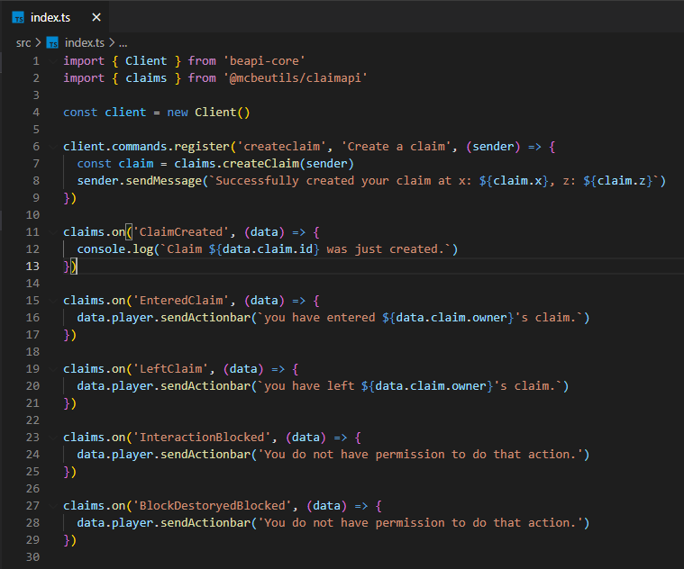

# ClaimAPI

ClaimAPI is a [BeAPI](https://github.com/MCBE-Utilities/BeAPI) module that allows players to create claimed boundaries so that untrusted players can not interact with that claimed land.

The module can be either imported as a Minecraft Bedrock Addon or be used within another BeAPI project.

## Installing as an Addon
* Requirements
  * [Minecraft Bedrock ^1.18.10.x](https://minecraft.net/)

To download and install, download the latest .mcpack release from [here](https://github.com/MCBE-Utilities/ClaimAPI/releases/tag/1.0.0).
Once you have downloaded the addon, import the .mcpack into Minecraft Bedrock.
Then, create a new world, or add to existing, and make sure to enable Gametest Framework.
Finally, you now have ClaimAPI installed on your Bedrock world.

## Installing as a Dependency
* Requirements
  * [node.js](https://nodejs.org/)
  * [BeAPI](https://github.com/MCBE-Utilities/BeAPI)
  * [Minecraft Bedrock ^1.18.30.x](https://minecraft.net/)

To download and install, you can either git clone this repo and use the mcpe pack, or run the command below in your BeAPI project.
```npm install @mcbeutils/claimapi```
Once you have done that, you can now import "@mcbeutils/claimapi" into your main project.
